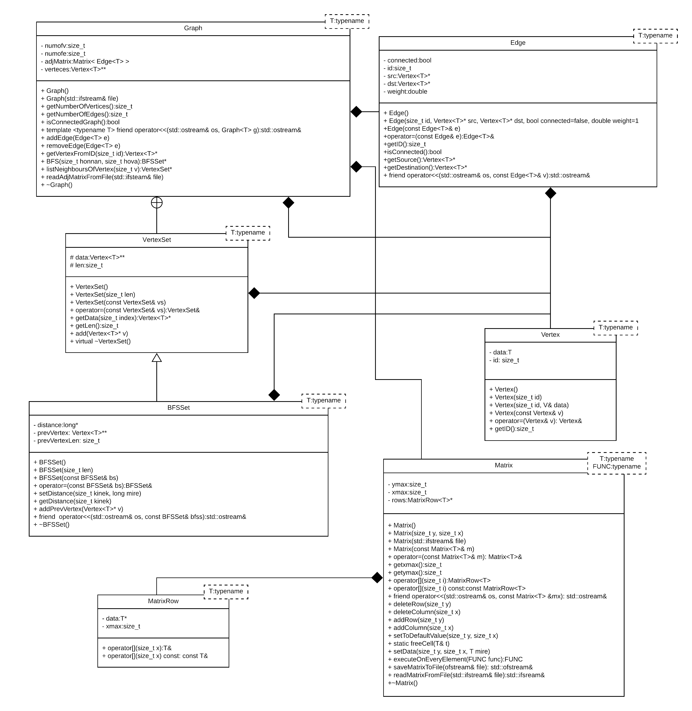

# Generikus irányítatlan gráf terv
# Generikus irányítatlan gráf terv

[TOC]

## Osztályok

@image latex ./pics/UMLv2.png

A feladat megvalósításához előreláthatólag 7 db osztályt használok fel. A tanult eszközök közül az öröklést, az egymásba ágyazott osztályokat és a tartalmazást tervezem felhasználni. Az ábrán még nem szerepel, de a diagram bővülni fog a teszteléshez használt példa osztályokkal.

### Felhasznált osztályok

#### Graph Osztály

Ez az osztály fogja össze a maradék 6 db osztályt. Ez az osztály tartalmazza, a feladatkiírásban szereplő feladatokat megvalósító függvényeket. A legtöbb feladat több segédfüggvényre van bontva.

#### Edge Osztály

Ez az osztály foglalja össze az élekhez tartozó információkat. Az osztály megkülönbözteti az élnek a forrás és cél csúcsát. Ezzel a felkészítve arra, hogy a jövőben irányított gráfokat is tudjon kezelni. A `weight` változó lehetővé teszi, hogy az éleket súlyokkal lássuk el, ez szintén a jövőbeli továbbfejlesztés lehetőségét szolgálja.

#### Vertex Osztály

Ez az osztály tárolja a csúcsokhoz tartozó adatokat. Mindent csúcsot ellátok egy azonosítóval. Ez a BFS algoritmus során segít a csúcsok megkülönböztetésében és így tudok valamilyen módon hivatkozni a csúcsokra.

#### VertexSet Osztály

Ezt az osztályt azért hoztam létre, hogy a függvényekből visszatérő adatokat egységbe tudjam foglalni. Így A dinamikus tömb és annak mérete egymás mellett tárolódik, könnyen elérhető. Az osztály a `Graph` osztály részét képezi, mert logikailag oda tartozik.

#### BFFSet Osztály

Ez az osztály a `VertexSet` osztályból származik. A célja hasonló. Ez kifejezetten a BFS algoritmus visszatérési értékének a tárolója.

#### Matrix Osztály

Ez az általános felhasználásra szánt osztályt felelős a fájlból történő beolvasás mátrixának tárolására. Az osztály tervezése során felhasználtam a programozás 1 tárgy keretein belül készített házim(mátrix függvénykönyvtár) létrehozása során szerzett tapasztalataimat.

#### MatrixRow Osztály

Ez az osztály azért jött létre, hogy a mátrix osztály kettős indexelését lehetővé tegye. Ezen kívül ennek az osztálynak a segítségével elkerülhető, hogy a Mátrix osztályban `T***` típusú adatot kelljen tárolni.

### Bővíthetőség

A program tervezése során lehetőséget biztosítottam a jövőbeli bővíthetőségre és továbbfejlesztésre. 

- A mátrix és a gráf generikus, így bármilyen adatot képes tárolni
- Az élek fel vannak készítve irányított gráfok által való használatra
- Az élekben található `weight` paraméter lehetőséget teremt, hogy a gráf éleit súlyokkal lássuk el.

## Felhasznált algoritmus

A specifikációban már említettem, hogy a program célja a [BSZ2](http://cs.bme.hu/bsz2) tárgyból tanultak elmélyítése. Így a szélességi bejárás algoritmusát is a tárgyban tanultak alapján szeretném megvalósítani. Az algoritmus és annak teljes leírása [itt](http://cs.bme.hu/bsz2/bfs.pdf) érhető el. Szeretném kiemelni az alábbi fontosabb részt:

@image latex ./pics/BFS.png

Az algoritmusom megvalósítása közben hasonló változóneveket szeretnék használni. Az algoritmust jelenleg egy helyen tervezem módosítani. A `*` távolság helyett `-1`-et tervezek használni. Nálam ez lesz a végtelen jelölése, ez hibakeresés során jól megkülönböztethető lesz a többi távolság értéktől.